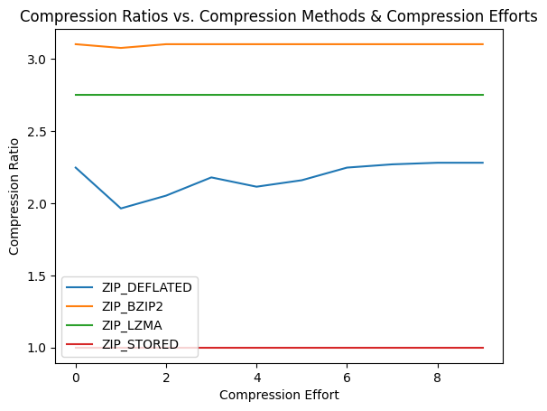

# Using the Python `zipfile` library on separately on each electrode's data

Creating a proper baseline by compressing each `.wav` file from each electrode separately using Python's compression algorithms contained in `zipfile`. 

Experimented with the following compression algorithms:
- `ZIP_STORED`: No compression algorithms applied
- `ZIP_LZMA`
- `ZIP_DEFLATED`
- `ZIP_BZIP2`

Methods were tested with a range of "compression effort" levels, which as expected trade off computation time for smaller compressed file sizes. `analysis.ipynb` details the comparasions between the different methods. `iterated_eval.sh` is used to call (a modified) `eval.sh` with different arguments, and `eval_copy.sh` is a copy of the `eval.sh` script used for this. To replicate the results, copy the contents of `eval_copy.sh` and replace the contents of `eval.sh` (in the repo root directory) with it. 

## Results

### Compression Level

### Delay Time

